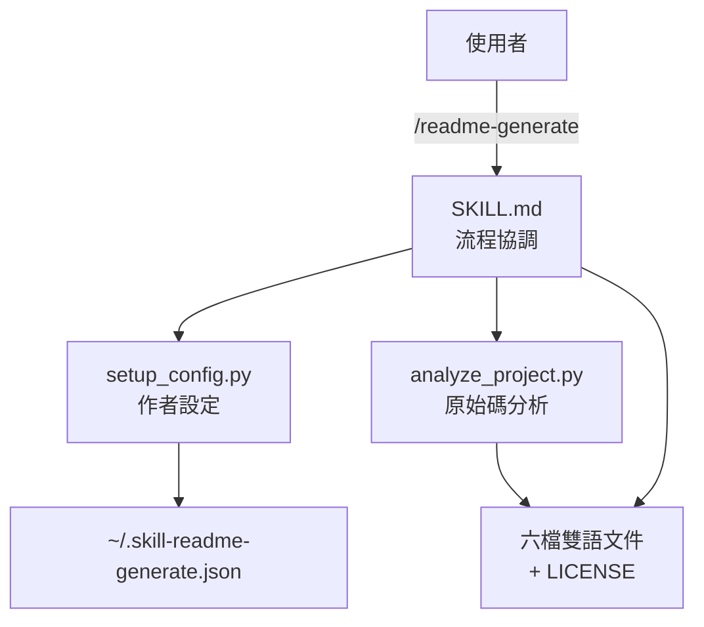

> [!NOTE]
> 此 README 由 [SKILL](https://github.com/agenvoy/skill-readme-generate) 生成，英文版請參閱 [這裡](../README.md)。 
> 此 skill 的實作內容全由 agent 生成，開發者僅針對 input / output 進行調整。

***

<strong>BILINGUAL READMES AUTO-GENERATED FROM YOUR SOURCE!</strong>

***

> Agent Skill，具備六檔雙語文件、原始碼分析與內建授權範本

## 目錄

- [功能特點](#功能特點)
- [架構](#架構)
- [授權](#授權)

## 功能特點

> 部署至 `<skills-dir>/readme-generate/` · [完整文件](./doc.zh.md)

- **六檔雙語輸出** — 單次執行產出 README、doc、architecture 各英中兩版，中文優先撰寫再翻譯以確保術語一致。
- **原始碼驅動分析** — `analyze_project.py` 對 Python（AST）/ Go / JS / TS 解析匯出型別、函式簽章與相依，PHP 與 Swift 僅做檔案層級偵測。
- **不綁定 Harness** — 腳本路徑依 skill 實際載入位置解析、不指名任何工具，任何能讀取 `SKILL.md` 的 agent harness 皆可執行。
- **持久化作者設定** — `setup_config.py` 於 `~/.skill-readme-generate.json` 維護作者 / Email / GitHub，首次建立後跨專案重複使用。
- **七種內建授權範本** — MIT、Apache-2.0、GPL-3.0、BSD-3-Clause、ISC、Unlicense、Proprietary 全內建，未指定且無 LICENSE 時預設 MIT。

## 架構

> [完整架構](./architecture.zh.md)

## 授權

本專案採用 [MIT LICENSE](../LICENSE)。
