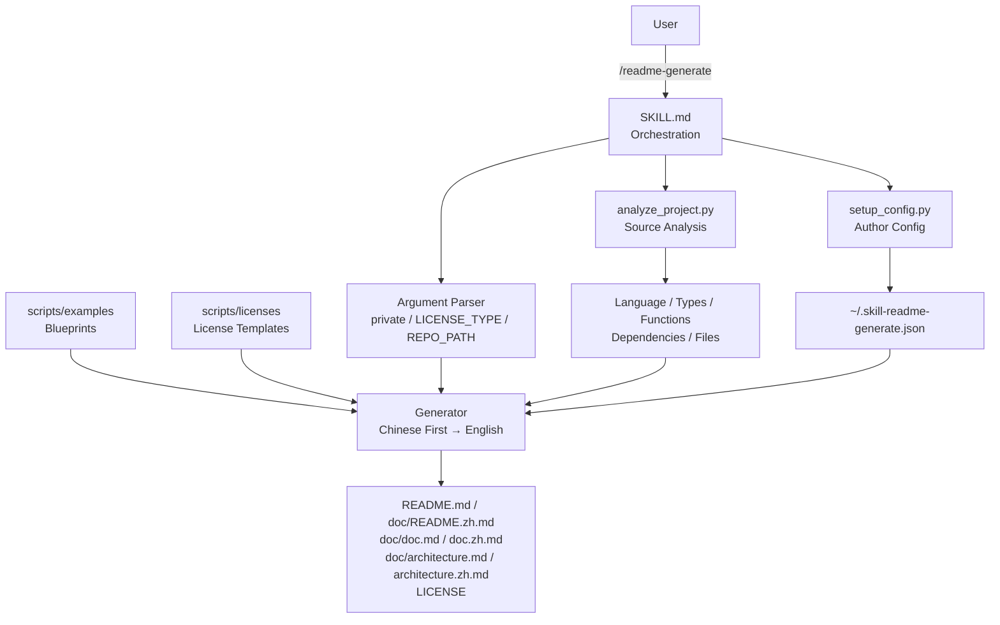
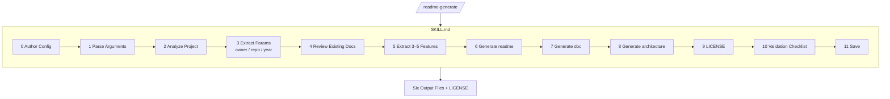
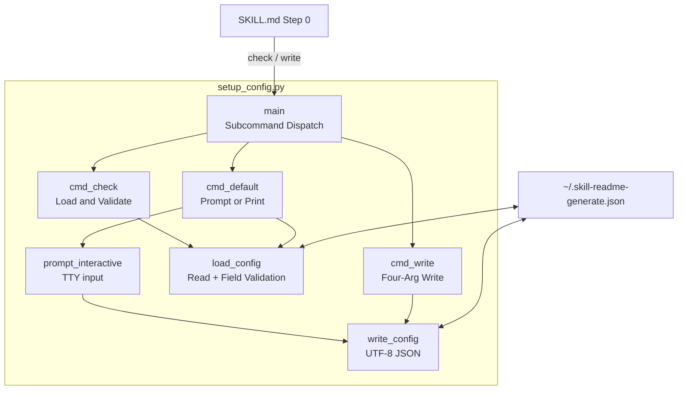
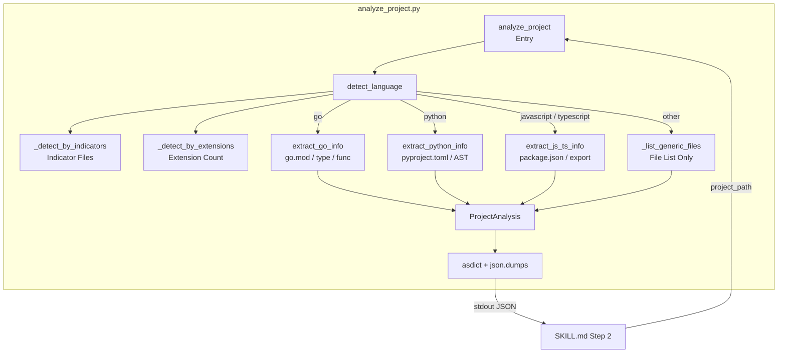
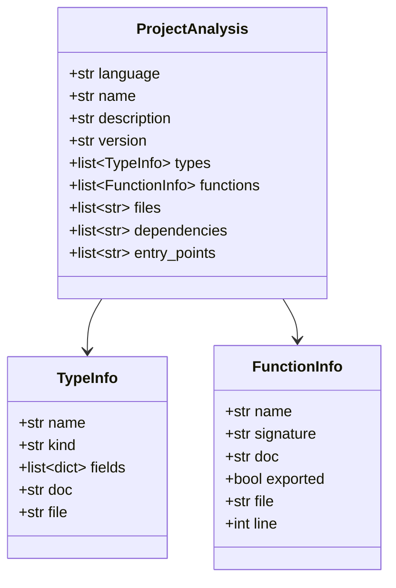
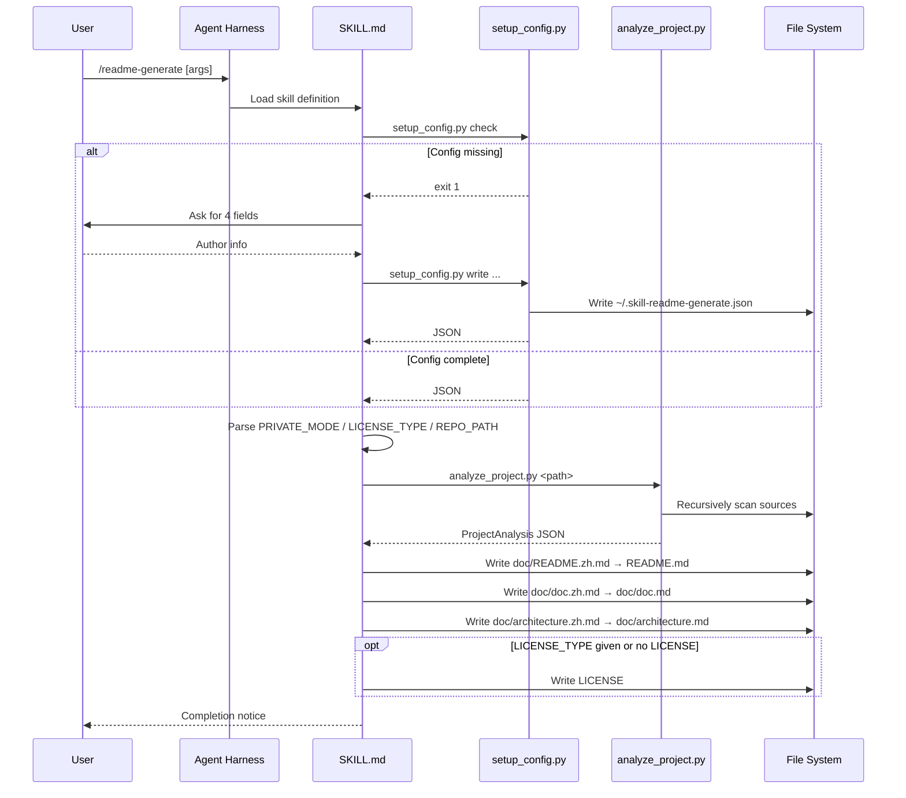
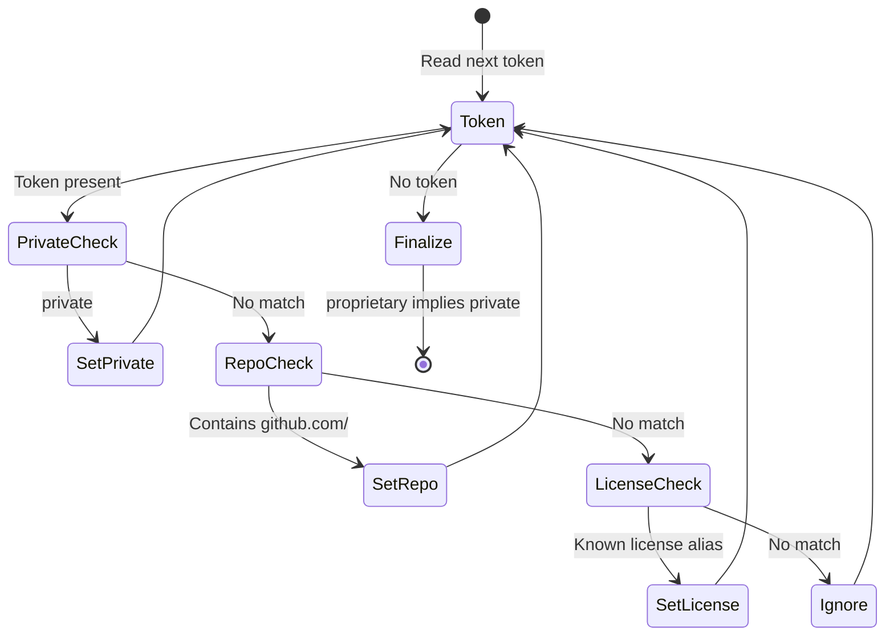

# readme-generate - Architecture

> Back to [README](../README.md)

## Overview

## Module: SKILL.md (Orchestration)

Defines the workflow, section ordering, and validation checklist the agent follows when executing the skill. Contains no executable code; it constrains LLM behavior through prompt instructions, and script paths use `{skill_dir}`, resolved from the actual load location.

## Module: setup_config.py (Author Config)

Provides interactive creation, non-interactive write, and existence check. The config is stored as UTF-8 JSON at `~/.skill-readme-generate.json`, and all four fields must be non-empty strings.

**Input / Output**:

| Subcommand | stdin | stdout | stderr | Exit |
|------------|-------|--------|--------|------|
| `check` | - | JSON | `MISSING` when absent | 0 / 1 |
| `write` | - | JSON | Save path or error | 0 / 2 |
| default | TTY | JSON | Prompts | 0 / 2 |

## Module: analyze_project.py (Source Analysis)

Detects the primary language, dispatches to the matching extractor, and serializes a unified `ProjectAnalysis` to JSON.

**Data Classes**:

`entry_points` is a data class field but is not included in the output JSON.

## Data Flow

Full flow of a single `/readme-generate` invocation:

## Argument Parsing State Machine

Detection and classification of the three optional arguments:

