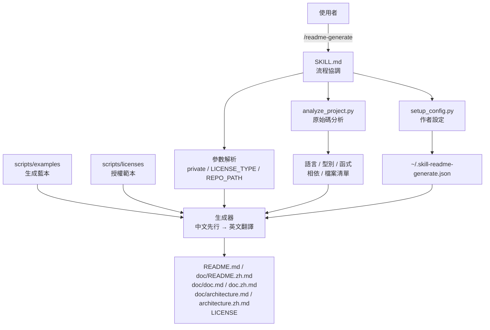
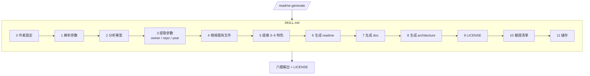
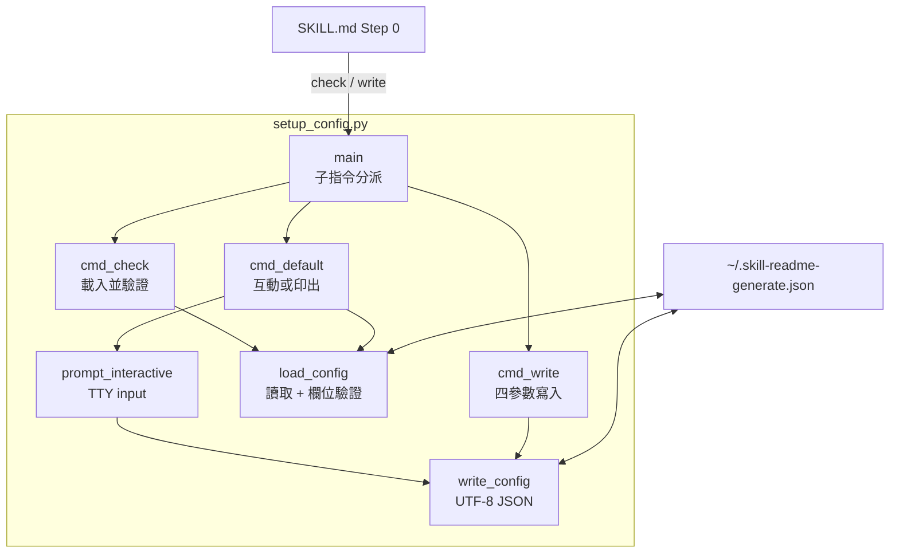
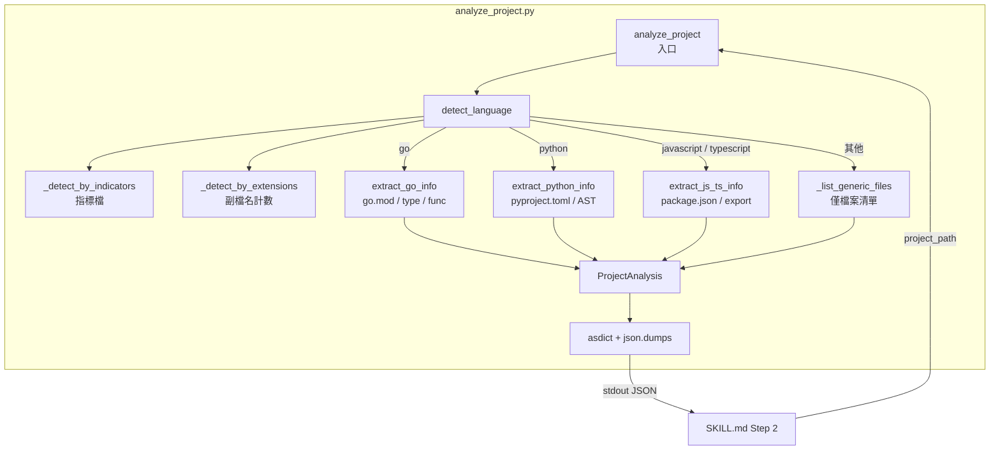
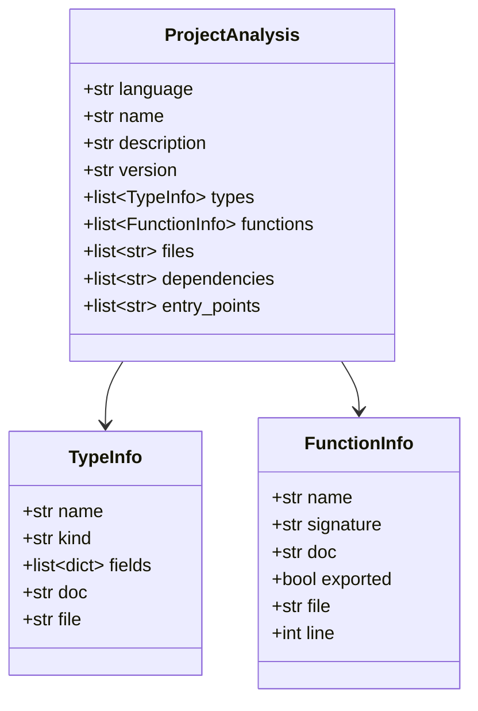
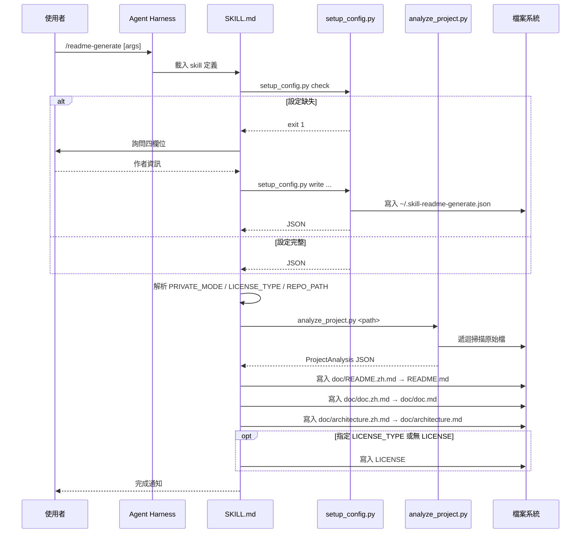
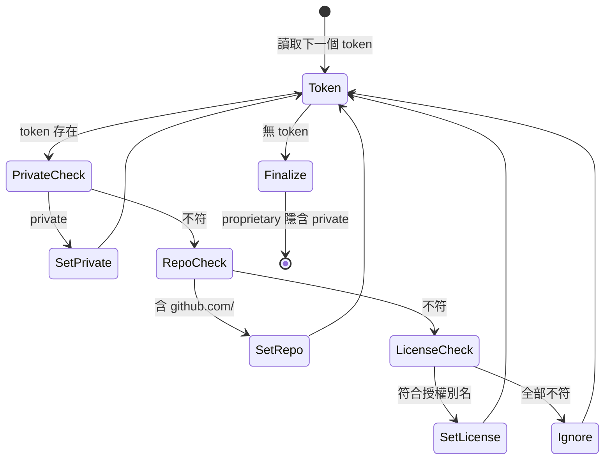

# readme-generate - 架構

> 返回 [README](./README.zh.md)

## 概覽

## Module: SKILL.md（流程協調）

定義 agent 執行此 skill 時需遵守的工作流程、區段順序與驗證清單。本身不含執行碼，僅以提示詞約束 LLM 行為；腳本路徑以 `{skill_dir}` 表示，依實際載入位置代入。

## Module: setup_config.py（作者設定）

提供互動建立、非互動寫入、存在性檢查三種模式。設定以 UTF-8 JSON 存放於 `~/.skill-readme-generate.json`，四個欄位皆須為非空字串。

**輸入／輸出**：

| 子指令 | stdin | stdout | stderr | exit |
|--------|-------|--------|--------|------|
| `check` | - | JSON | 缺失時 `MISSING` | 0 / 1 |
| `write` | - | JSON | 儲存路徑或錯誤 | 0 / 2 |
| 預設 | TTY | JSON | 提示文字 | 0 / 2 |

## Module: analyze_project.py（原始碼分析）

偵測主要語言後調用對應 extractor 提取結構資訊，輸出統一的 `ProjectAnalysis` 序列化 JSON。

**資料類別**：

`entry_points` 為資料類別欄位，但不包含在輸出 JSON 中。

## 資料流

單次 `/readme-generate` 呼叫的完整流程：

## 參數解析狀態機

三個選填參數的偵測與分類：

